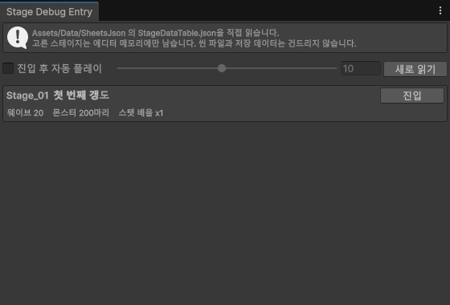
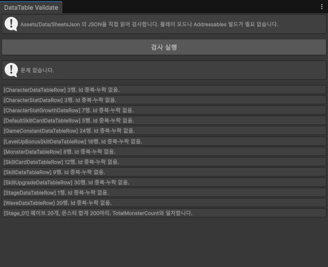

# 에디터 도구

웨이브 디펜스 개편과 함께 만든 도구 4개입니다. 전부 에디터 전용이라 빌드에
들어가지 않습니다.

| 메뉴 | 소스 | 창이 뜨는가 |
|---|---|---|
| `Tools/MainGame/Stage Debug Entry` | `Editor/StageDebugEntryWindow.cs` | 뜹니다 |
| `Tools/MainGame/Auto Play x10 / x1 / Stop` | `Editor/InGameAutoPlayTester.cs` | 안 뜹니다 |
| `Tools/MainGame/Build In-Game Scene` | `Editor/MainGameSceneBuilder.cs` | 안 뜹니다 |
| `Tools/DataTable/Consistency Check` | `Editor/DataTableConsistencyWindow.cs` | 뜹니다 |

---

## Stage Debug Entry



**스테이지를 골라 인게임에 바로 들어갑니다.**

### 언제 쓰는가

스테이지 2~10의 밸런스를 잴 때입니다. 1번부터 차례로 뚫으면 측정 한 번에
스테이지 수만큼 5분이 곱해집니다.

### 사용 절차

1. `Tools/MainGame/Stage Debug Entry`로 창을 엽니다
2. 목록에서 원하는 스테이지의 **[진입]**을 누릅니다
3. `MainGameScene`이 열리고 플레이 모드가 시작됩니다

**[진입 후 자동 플레이]**를 켜 두면 들어가자마자 자동 플레이가 배속으로
시작됩니다. 옆 슬라이더가 배속(1~20)입니다. 이 설정은 다음에도 유지됩니다.

플레이 중에 다른 스테이지의 **[진입]**을 눌러도 됩니다. 플레이를 껐다가
그 스테이지로 다시 들어갑니다.

**[새로 읽기]**는 시트를 다시 익스포트한 뒤 목록을 갱신할 때 씁니다.

### 목록에 나오는 값

각 줄에 웨이브 수, 총 몬스터 수, 스탯 배율이 표시됩니다. 아래 경고가 뜨면
들어가기 전에 확인하십시오.

- **WaveDataTable에 이 스테이지의 행이 없습니다** — 들어가도 몬스터가 나오지
  않습니다. 5분을 버리기 전에 알라고 띄웁니다
- **웨이브 행이 N개인데 WaveCount는 M입니다** — 시트 두 탭이 어긋난 상태입니다

### 주의사항

- **씬 파일과 저장 데이터를 건드리지 않습니다.** 고른 Id는 에디터 메모리
  (`SessionState`)에만 들어갑니다. 지정 진입을 몇 번 하든 저장소에 변화가 남지
  않고, 커밋에 섞이지 않습니다
- **해금 상태를 흉내 내지 않습니다.** 그 스테이지에서 시작만 합니다(기획 확정)
- **에디터를 닫으면 지정이 사라집니다.** 다음에 켰을 때 이전 지정이 남아 헛
  측정할 일이 없습니다
- **반대로, 에디터를 닫기 전까지는 계속 남습니다.** 이게 실제로 물린 자리입니다.
  같은 세션 안에서 다른 스테이지를 재려고 코드나 다른 경로로 진입해도, 그쪽이
  스테이지를 지정하지 않으면 **여기서 박아 둔 값이 조용히 이깁니다.** 스테이지 1을
  요청했는데 2가 열리고, 에러는 한 줄도 안 납니다.
  측정을 자동화할 때는 **요청한 스테이지가 아니라 실제로 열린 `_stage.Id`를 읽어
  기록하십시오.** 그러면 어긋나도 데이터가 거짓말을 하지는 않습니다.
  한 세션에서 여러 스테이지를 잴 거라면 시작 전에 **[해제]**를 누르거나
  `SessionState.SetString("MiningGirl.Debug.StageId", "")`로 비우십시오
- **지정 중에는 창 위에 노란 띠로 표시됩니다.** 씬을 그냥 재생해도 그 스테이지로
  들어가므로, 평소 상태로 돌아가려면 **[해제]**를 누르십시오
- 씬이 열려 있지 않으면 열면서 저장 여부를 묻습니다

---

## Auto Play

**인게임 한 판을 사람 손 없이 배속으로 끝까지 돌립니다.**

### 언제 쓰는가

밸런스 측정입니다. 한 판이 3~4분이라 값을 바꿀 때마다 앉아 있을 수 없습니다.
x10이면 한 판이 30초 안쪽입니다.

### 사용 절차

1. **먼저 플레이 모드에 들어갑니다**
2. `Tools/MainGame/Auto Play x10` (또는 `x1`)
3. 멈추려면 `Tools/MainGame/Auto Play Stop`

3택이 뜨면 무작위로 하나를 고르고, 결과 화면이 뜨면 자동으로 멈춥니다.

### 주의사항

- **플레이 모드 전용입니다.** 에디트 모드에서 부르면 콘솔에 에러가 남고 아무
  일도 일어나지 않습니다
- **3택은 무작위로 고릅니다.** 사람이 고르는 것과 결과가 다릅니다. 판마다
  편차가 큰 원인이 대부분 여기입니다
- 배속은 `Time.timeScale`입니다. 3택이 뜨면 0이 되므로 매 프레임 다시 겁니다
- 플레이 모드를 나가면 자동으로 정지합니다
- 메뉴 경로는 `Tools/MainGame/`인데 소스 파일명은 `InGameAutoPlayTester.cs`입니다
- **측정 전에 저장 파일을 지우십시오.** 진입 우선순위가 `지정 진입 > 저장 >
  StageEntry > 인스펙터`라서, **판 도중에 플레이 모드를 끄면 남은 저장이 다음
  진입을 이깁니다.** 실제로 물린 자리입니다 — 스테이지 2를 열려는데 계속 5가
  열렸고, 한 번은 **경과 223초짜리 거의 끝난 판이 복원돼 그대로 결과로 찍혔습니다.**
  `Manager.Save.RunSaveStore.Clear()`로 지우고 시작하십시오.

  **`SessionState` 함정보다 나쁩니다.** 두 함정을 가르는 축은 **화면에 티가 나는가**입니다.

  | | 무슨 일이 | 왜 |
  |---|---|---|
  | `SessionState` | 엉뚱한 스테이지가 열림 | 화면이 다르니 언젠가는 봅니다 |
  | 저장 복원 | **맞는 스테이지 + 거짓 결과** | 화면이 정상이라 안 띕니다 |

  그래서 판 끝 로그가 `[저장 복원된 판 - 측정에 쓰지 마십시오]`를 찍고,
  `MainGameController.DebugIsRestored`로도 읽을 수 있습니다.
  **사람이 로그를 읽어야 하면 그것도 절차입니다 — 측정이 스스로 버리게 하십시오.**

### 여러 판을 무인으로 돌리기

한 판씩 손으로 다시 누르면 스무 판에 사람이 붙어야 합니다. 결과 화면에서
**다시하기**를 누르고 봇을 다시 거는 것을 `EditorApplication.update`에 걸면
무인으로 계속 돕니다. 열여덟 판을 그렇게 돌렸습니다.

- `다시하기`는 `SceneManager.LoadScene`이라 **판끼리 독립입니다.** 표본으로 씁니다
- 완료 수는 `SessionState`에 넣으십시오. 씬이 다시 로드돼도 남습니다
- **`execute_code`로 건 콜백은 도메인 리로드로 사라집니다.** 판을 돌리는 중에는
  스크립트를 고치지 마십시오 — 컴파일이 그 판을 끊습니다

### 화면비를 바꿔 잡을 때

기기별로 다르게 보이는 것을 재려면 게임뷰 크기를 바꿔야 합니다.
`UnityEditor.GameViewSizes`에 크기를 등록하고 `GameView.selectedSizeIndex`로 고릅니다.

- **크기를 바꾼 뒤 게임뷰를 `Focus()` + `Repaint()` 하십시오.** 안 하면
  `Screen.width/height`가 **옛 값을 그대로 들고 있습니다.** 선택 크기와 실제
  렌더 크기가 갈라진 채로 측정이 돌아갑니다
- **그 다음 씬을 다시 부르십시오.** `BattleBounds`가 시작할 때 카메라에서
  `HalfWidth`를 뽑아 두므로, 화면비만 바뀌고 씬이 그대로면 **옛 폭으로 계속 돕니다.**
  실제로 물렸습니다 — 화면은 9:19.5인데 `HalfWidth`가 3:4의 9.75였습니다
- **이게 `SafeArea` 버그와 같은 기전입니다.** 두 값이 같은 순간을 안 기다리면
  어느 쪽도 틀린 게 아닌 채로 결과만 틀립니다. **한 번 고쳐서 끝나는 버그가
  아니라 측정할 때마다 밟는 함정입니다**

**확인하는 법** — 판을 시작하고 `_bounds.HalfWidth`를 찍으십시오.

```
기대값   카메라 orthographicSize x aspect      13 x 0.75 = 9.75 (3:4)
                                             13 x 0.462 = 6.00 (9:19.5)
```

**값이 옛 화면비의 것이면 씬을 다시 부르면 됩니다.** 판 시작에 이 한 줄을 찍어
두면 어긋난 채로 돈 판을 나중에 골라낼 수 있습니다 — 저장 복원 표시와 같은
생각입니다. **절차로 막지 말고 기록으로 막으십시오.**

### 조건이 맞는 프레임만 자동으로 캡처하기

"판을 보다가 이런 화면이 나오면 알려 주십시오"는 운에 맡기는 것입니다.
조건을 코드로 걸고 맞는 프레임에서 `ScreenCapture.CaptureScreenshot`을
부르면 최악 화면이 잡힙니다.

- 실제로 이렇게 잡았습니다 — **밝은 몬스터가 글자 뒤에 완전히 겹친 순간**,
  **발사체가 일곱 개 동시에 뜬 프레임**
- **"안 나온다"의 증거로도 씁니다.** 조건을 걸고 열두 판 전 프레임을 훑어 0회면
  그건 표본이 아니라 전수입니다
- **조건이 재려는 것만 남기는지 보십시오.** 무조준 발사만 보려고 조건을
  `발사체 3개 이상 + 살아 있는 몬스터 1마리 이하`로 걸었다가, **그 1마리를
  조준한 발이 섞였습니다.** 각도를 재 보니 한 발이 부채 범위 밖(23.5도)에
  있어서 드러났습니다. `0마리`로 조여야 깨끗합니다
- **그런데 조여도 다 안 걸러집니다.** 생존 0으로 조인 프레임에서도 **-26.7도**가
  나왔습니다. 조준 발이 아니라 **앞 볼리의 바깥쪽 발**입니다 — 0.2초 간격으로
  나가고 발사체가 오래 살아서, 앞 볼리가 화면에 남은 채로 다음 볼리가 나갑니다.

  **이쪽이 더 잡기 어렵습니다.** 조준 발은 "몬스터가 있었나"로 걸러지는데,
  볼리끼리 섞인 것은 **출처가 같은 코드 경로라 조건으로 못 가릅니다.**
  각도를 같이 남기고 **간격이 일정한 것끼리 묶으십시오** — 한 볼리는 등차수열입니다.
  그림으로는 안 보입니다
- 조건을 넓혀서 억지로 잡지 마십시오. **안 잡히는 것 자체가 "게임이 그 화면을
  거의 안 만든다"는 답입니다**
- **0회가 "안 일어난다"를 뜻하려면 조건이 맞아야 합니다.** 조건을 잘못 걸면
  0회는 "안 일어난다"가 아니라 **"내 조건이 틀렸다"**입니다. 전수라는 말이
  조건의 정당성까지 보장하지는 않습니다

---

## Build In-Game Scene

**`MainGameScene`을 코드로 다시 짓습니다.**

### 언제 쓰는가

인게임 UI 구성을 바꿨을 때입니다. **이 빌더가 씬의 정본**이라, 씬에서 직접
만든 것은 다음 재생성 때 사라집니다. UI를 추가하면 빌더에도 넣어야 합니다.

### 사용 절차

1. **열려 있는 씬을 저장합니다** (아래 주의사항)
2. `Tools/MainGame/Build In-Game Scene`
3. 콘솔에 `[Builder] 완료`가 뜨면 끝입니다

### 무엇을 만드는가

카메라, 타워, 캐릭터 자리, 몬스터·발사체·피해 숫자 레이어, 상단 HUD(스테이지
번호·웨이브·경험치 게이지·시간·메뉴 버튼·배속 버튼), 하단 띠(타워 체력·스킬
슬롯), 오버레이 3종(3택·결과·정지 메뉴)을 만들고 `MainGameController`에
전부 연결합니다.

### 주의사항

- **되돌릴 수 없습니다.** 씬을 통째로 다시 짓습니다. Undo로 복구되지 않습니다
- **실행 전에 저장하십시오.** 열려 있는 씬의 저장하지 않은 변경사항이 날아갑니다
- **씬에서 손으로 고친 값은 전부 사라집니다.** 인스펙터에서 수치를 조정했다면
  빌더 코드에도 반영한 뒤에 돌리십시오
- 프리팹(스킬 슬롯, 3택 카드, 별 아이콘, 피해 숫자)은 다시 만들지 않고
  가져다 씁니다. 프리팹을 고치는 건 안전합니다

---

## Consistency Check



**시트에서 뽑은 JSON끼리 아귀가 맞는지 검사합니다.**

값이 옳은지가 아니라 **서로 어긋나지 않는지**를 봅니다. 공격력 4가 적절한지는
판단하지 않고, `TotalMonsterCount`와 웨이브별 마리 수 합계가 다르면 잡아냅니다.

### 언제 쓰는가

**익스포트한 직후입니다.** 시트 수정이 한 행씩 밀려 들어가거나 두 탭이
어긋나는 사고가 실제로 있었습니다. 그런 종류는 게임을 돌려도 조용히 기본값으로
넘어가서 한참 뒤에야 드러납니다.

### 사용 절차

1. `Tools/DataTable/Consistency Check`로 창을 엽니다
2. **[검사 실행]**을 누릅니다
3. 결과가 아래에 줄줄이 뜹니다

### 무엇을 검사하는가

- **모든 테이블 공통** — 파일 존재, 파싱 성공, Id 중복·누락. 테이블이 늘어도
  자동으로 포함됩니다
- **테이블 사이의 약속** — 테이블 둘이 같은 것을 가리킬 때 어긋났는지

> 예전에는 `StageDataTable.TotalMonsterCount`와 `WaveDataTable`의 마리 수 합계를
> 대조했습니다. **그 검사는 잘 돌았는데 아무도 안 돌렸고, 시트 200 대 실제 182로
> 어긋난 채 지나갔습니다.** 그래서 열 자체를 없애고 웨이브에서 세도록 바꿨습니다.
> **안 돌리는 검사는 없는 검사입니다** — 대조할 짝을 없앨 수 있으면 그쪽이 낫습니다.

### 주의사항

- **플레이 모드도 Addressables 빌드도 필요 없습니다.** `Assets/Data/SheetsJson`의
  JSON을 직접 읽습니다
- **읽기만 합니다.** 파일을 고치지 않습니다
- **런타임에 관여하지 않습니다.** 검사 규칙이 전부 이 에디터 코드에 있어서
  데이터 클래스와 `DataTableManager`는 건드리지 않습니다
- 기획 규칙은 코드에 적어야만 알 수 있습니다. 새 규칙이 생기면 이 파일에
  추가해야 검사됩니다

---

## 문서에 없는 도구

같은 `Tools/` 아래에 아래 항목도 있지만 이 문서의 대상이 아닙니다.

```
Tools/Project/Project Tools
Tools/Balancing/Stat Curve Preview (Advanced)
Tools/DataTable/Add JSONs to Addressables
Tools/DataTable/Export All (Google Drive Folder)
```

`Export All`에 대해 하나만 적어 둡니다 — **OAuth 로그인이 필요해서 사람이
브라우저로 인증해야 돌아갑니다.** 자동화된 세션에서는 쓸 수 없고, 그 경우
시트를 읽어 이 도구의 변환 함수(`ConvertCellValue` / `SerializeToJsonStable` /
`WriteFileIfChanged`)를 직접 호출하는 우회 경로를 씁니다. 변환 규칙을 따로
구현하면 쉼표 처리 같은 데서 갈라지고, 그 갈라짐은 파싱이 조용히 실패하는
형태로 나타납니다.

---

## 스크린샷을 다시 뽑으려면

에디터 창은 `UnityEditorInternal.InternalEditorUtility.ReadScreenPixel`로
캡처할 수 있습니다. 창을 `Focus()`하고 `Repaint()`한 뒤 `position`을 그대로
넘기면 됩니다. `Auto Play`와 `Build In-Game Scene`은 창이 없어 캡처할 화면이
없습니다.
